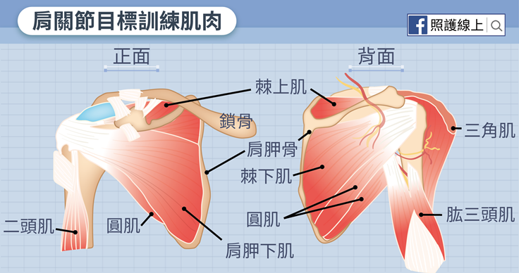
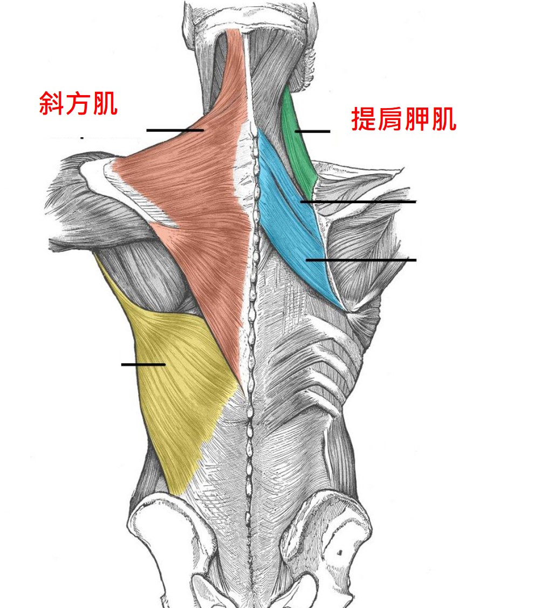

- https://www.youtube.com/user/ray123822/videos
- 重訓[[肩膀]][[拉傷]]
	- 相關肌群
		- 肩胛骨[[旋轉肌群]]
			- 棘上肌、棘下肌、小圓肌、肩胛下肌、二頭肌近端肌腱 {:height 286, :width 539}
			-
		- 脊柱肌群
			- 頸部肌群：斜方肌、提肩胛肌
			- {:height 284, :width 244}
			-
		-
	-
	-
-